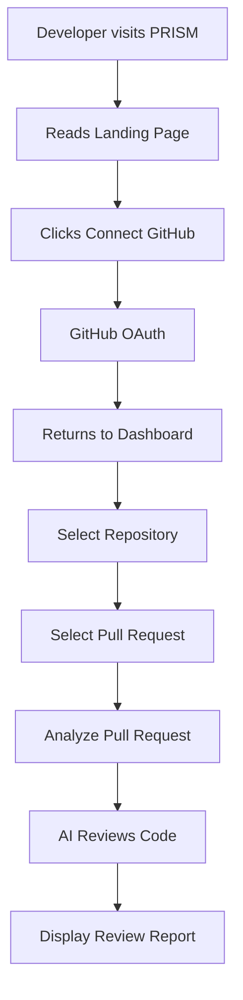

# 🚀 PRISM – Project Flow

> **Version:** v1.0  
> **Status:** 🟡 Planning Stage  
> **Goal:** Design the complete user journey before writing code.

---

# 📖 Project Vision

PRISM is an AI-powered Pull Request Review platform.

It helps developers review GitHub Pull Requests before merging by using AI to identify:

- Security vulnerabilities
- Performance improvements
- Code quality issues
- Edge cases
- Best practices

The goal of PRISM v1 is to provide developers with a simple and interactive web application for reviewing Pull Requests.

---

# 🎯 Target Users

- Individual Developers
- Open Source Contributors
- Students
- Freelancers
- Startup Teams

---

# 🗺 User Journey



---

# 📄 Product Pages

## 1. Landing Page

### Purpose

Introduce PRISM and explain why developers should use it.

### User can

- Learn what PRISM does
- Read features and benefits
- Click **Connect GitHub**

---

## 2. GitHub Authentication

### Purpose

Allow the developer to securely connect their GitHub account.

### Flow

```text
Click Connect GitHub

↓

GitHub Login

↓

Grant Permission

↓

Redirect back to PRISM
```

---

## 3. Dashboard

### Purpose

Display the developer's GitHub repositories.

### User can

- View connected GitHub account
- Browse repositories
- Search repositories (Future)
- Open a repository

---

## 4. Repository Page

### Purpose

Display all Pull Requests of the selected repository.

### Each Pull Request shows

- Title
- Author
- Status
- Created Date
- Changed Files Count
- Review Button

---

## 5. AI Review Processing

### Purpose

Show the current review progress.

### Steps

```text
Fetching Pull Request...

Reading Changed Files...

Filtering Files...

Preparing Prompt...

Sending Request to AI...

Generating Review...

Completed ✅
```

---

## 6. AI Review Result

### Purpose

Display the complete AI review.

### Sections

- Overall Summary
- AI Score
- Security
- Performance
- Code Quality
- Edge Cases
- Best Practices
- Suggestions

### User Actions

- Copy Review
- Review Another Pull Request

---

# ✅ PRISM v1 Scope

- GitHub OAuth
- Repository Selection
- Pull Request Selection
- AI Review
- Beautiful Review Report

---

# ❌ Not Included

- GitHub App
- Automatic PR Reviews
- Webhooks
- Team Dashboard
- Organization Support
- CI/CD Integration

---

# 💡 Design Principle

> Build the simplest version that solves a real problem.

Every feature added to PRISM should improve the developer's code review experience.
